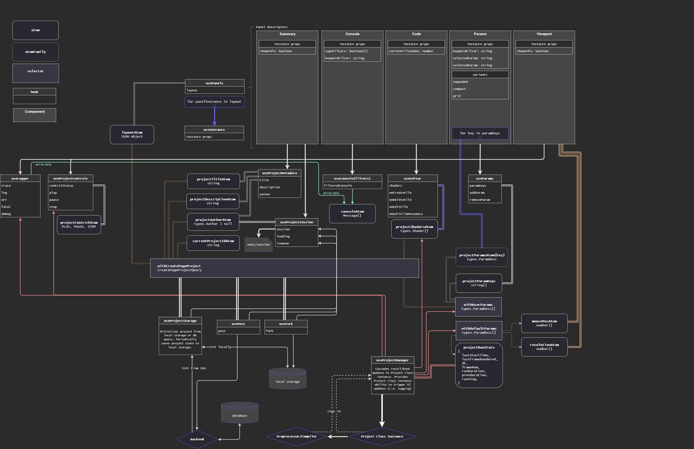

# Docs

## Non-comprehensive schematic of data flow in gputoy. This is *not* a UML table or anything official.
 (updated 2/5/2022)

## Contributing to GPUToy

Anyone familiar with `react`, `recoil`, `nextjs`, or `webgpu` is encouraged to contribute. 
I am also looking for a consultant for `Monaco Editor`, as I believe my implementation only scratches the surface of what's possible with its features. 